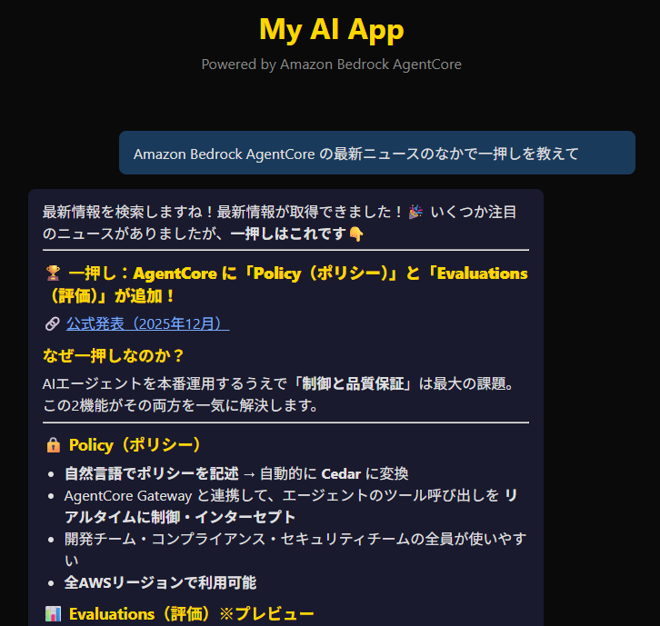
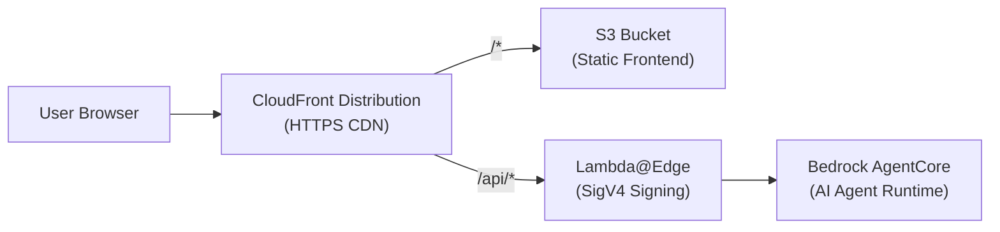

# Three Stars ⭐⭐⭐

The fastest AI agent deployment tool for prototyping on AWS.

Three Stars doesn't require you to set up CDK, wait for CloudFormation stack deployments, or struggle with circular dependency errors. All you need is Python — the same language you use to develop your AI agent. Our promise and principles are as follows.

- **Speed** — Deployment speed is our top priority
- **Steps** — Streamlined steps including tool setup and error handling
- **Small** — Just enough for prototyping

Three Stars provides the `sss` command (short for **s**peed **s**tep **s**mall) for quick deployment. Commands are available both as a CLI and as an MCP server for your AI coding agent.

| Command | Description |
|---------|-------------|
| `sss init <name>` | Scaffold a new project with config, frontend, and agent templates |
| `sss deploy` | Deploy (or redeploy) the project to AWS — S3, AgentCore, Lambda@Edge, CloudFront |
| `sss status` | Show deployment status of all AWS resources |
| `sss destroy` | Tear down all deployed AWS resources |


## Quick Start

**Prerequisites:**

- Python 3.12+
- AWS credentials configured (`aws configure`)
- Permissions for S3, CloudFront, IAM, Lambda, and Bedrock AgentCore

### Use with AI Agents (Recommended)

The easiest way to use three-stars is through an AI coding agent. three-stars provides scaffolding tools for agents like Claude Code.

Add this to your Claude Code MCP settings.

```json
{
  "mcpServers": {
    "three-stars": {
      "command": "uvx",
      "args": ["--from", "three-stars", "three-stars-mcp"]
    }
  }
}
```

### Install as CLI

```bash
pip install three-stars
```

This installs the `sss` command. From zero to deployed in four lines:

```bash
pip install three-stars
sss init my-app && cd my-app
sss deploy
# Open the printed CloudFront URL in your browser
```

### How Commands Work

#### Scaffold a Project : `sss init`

```bash
sss init my-app
cd my-app
```

This creates the following structure:

```
my-app/
├── three-stars.yml     # Configuration
├── app/                # Frontend — use any framework (React, Vue, etc.)
│   └── index.html
└── agent/              # AI agent (Python)
    ├── agent.py        # Strands Agent with SSE streaming
    ├── tools.py        # MCP tool loader
    ├── memory.py       # AgentCore Memory session manager
    └── mcp.json        # MCP server configuration
```

The `app/` directory starts with a plain HTML file, but you can replace it with your favorite frontend framework — React, Vue, Svelte, or anything that builds to static files. Just point `app.source` in the config to your build output directory.

The `agent/` directory contains a starter [Strands Agent](https://github.com/strands-agents/strands-agents-python) that streams responses as Server-Sent Events. It supports:

- **MCP Tools** — add tool servers in `agent/mcp.json` (stdio and HTTP transports). Environment variable references (`${VAR}`) and AWS credentials are forwarded automatically.
- **Conversation Memory** — when AgentCore Memory is configured, conversation history is preserved across turns within a session.

`three-stars.yml` controls your deployment:

```yaml
name: my-ai-app
region: us-east-1

agent:
  source: ./agent
  model: us.anthropic.claude-sonnet-4-6  # Any Bedrock model ID
  description: "My AI assistant"

app:
  source: ./app
  index: index.html

api:
  prefix: /api
```

#### Deploy to AWS : `sss deploy`

Deploy your application to AWS.

```bash
sss deploy
```

First deploy typically completes in **~5 minutes**.

```
[1/5] S3 storage ready                   0:00:01
[2/5] AgentCore ready                    0:00:48
[3/5] Lambda@Edge function ready         0:00:04
[4/5] CloudFront distribution deployed   0:00:45
[5/5] AgentCore resource policy set      0:00:02

     Post-Deployment Health Check
┌────────────┬───────────────────┬──────────┐
│ Resource   │ ID / Name         │ Status   │
├────────────┼───────────────────┼──────────┤
│ S3 Bucket  │ sss-my-app-…      │ Active   │
│ AgentCore  │ rt-abc123         │ Ready    │
│ CloudFront │ E1234567890       │ Deployed │
└────────────┴───────────────────┴──────────┘

Deployed successfully!
URL: https://d1234567890.cloudfront.net
```

Open the URL to see your AI agent chat app — the frontend streams responses in real time with Markdown rendering and tool call indicators.





| Resource | Service | Purpose |
|----------|---------|---------|
| S3 Bucket | Amazon S3 | Frontend static files (private, OAC access) |
| AgentCore Runtime | Bedrock AgentCore | Runs AI agent code with Bedrock model access |
| Lambda@Edge Function | AWS Lambda@Edge | SigV4 signing for API requests to AgentCore |
| CloudFront Distribution | Amazon CloudFront | CDN with HTTPS |
| IAM Roles | AWS IAM | Execution permissions (AgentCore, Lambda@Edge) |

Subsequent deploys are even faster because dependencies are cached and only changed resources update.

```bash
sss deploy  # ~23 seconds on redeploy
```

| Flag | Description |
|------|------------|
| `--region` | Override AWS region |
| `--profile` | AWS CLI profile name |
| `--yes` / `-y` | Skip confirmation prompts |
| `--force` | Recreate all resources from scratch |
| `--verbose` / `-v` | Print detailed progress (ARNs, policy names) |

#### Check Status : `sss status`

Show deployment status of all AWS resources.

```bash
sss status
```

Use `--sync` to discover actual resources from AWS and update the local state file:

```bash
sss status --sync
```

| Flag | Description |
|------|------------|
| `--region` | Override AWS region |
| `--profile` | AWS CLI profile name |
| `--sync` | Refresh state from AWS before showing status |

#### Tear Down : `sss destroy`

Remove all deployed AWS resources.

```bash
sss destroy
```

Use `--name` to discover and destroy resources by project name when the state file is missing:

```bash
sss destroy --name my-app --region us-east-1
```

| Flag | Description |
|------|------------|
| `--region` | Override AWS region |
| `--profile` | AWS CLI profile name |
| `--yes` / `-y` | Skip confirmation prompt |
| `--name` | Project name for discovery (when state file is missing) |
| `--verbose` / `-v` | Print detailed progress |

> **Note:** Lambda@Edge functions cannot be deleted immediately. AWS cleans up edge replicas asynchronously after the CloudFront distribution is removed, which can take 30–60 minutes. If replicas still exist, `sss destroy` will report that the function remains and you can safely re-run the command later to finish cleanup.

## Development

To use the MCP server from a local checkout, point to the source directory:

```json
{
  "mcpServers": {
    "three-stars": {
      "command": "uv",
      "args": ["--directory", "/path/to/three-stars", "run", "three-stars-mcp"]
    }
  }
}
```

```bash
# Install in development mode
uv sync

# Run tests
uv run pytest

# Lint
uv run ruff check three_stars/ tests/

# Format
uv run ruff format three_stars/ tests/
```

## License

[Apache License 2.0](LICENSE)
